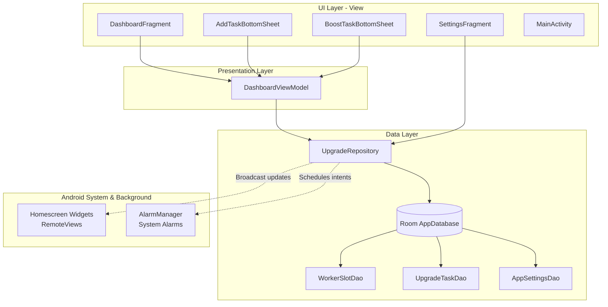

# 🛡️ ClashWidgets

[](https://developer.android.com/) [](https://www.oracle.com/java/) [](https://developer.android.com/topic/libraries/architecture) [](https://developer.android.com/training/data-storage/room)

**ClashWidgets** is a dedicated Android companion application designed specifically to track upgrade progress in **Clash of Clans** by Supercell. By providing responsive homescreen widgets, customizable daily helpers, and precision custom sound alarms, it allows Clashers to optimize their upgrades without needing to open the game constantly.

---

## 🌟 Vision & Credits

* 🎮 **Not a Game Recreation:** This application is built with the express purpose of creating widgets to keep track of upgrade timers in **Clash of Clans**. You can check out the original game on the Google Play Store or Apple App Store under the name *"Clash of Clans"* by *Supercell*. This is **NOT** a recreation of the game in any way.
* 🥷 **Inspiration:** The project is heavily inspired by **[Clash Ninja](https://www.clash.ninja/)**, the ultimate online website that allows players to track their base's progress. 
* 📱 **Core Goal:** The end goal is to have highly accessible widgets on the home screen from which users can quickly reference things like builder times, research times, pet upgrades, etc.
* ⚖️ **Terms of Service Compliance:** This app does not interact with the game servers, modify game files, or automate gameplay. It is built strictly as an offline helper tools app and **does not violate the game's Terms of Service (TOS)**.

---

## ✨ Key Features

### 1. Multi-Village Comprehensive Tracking
* **Home Village Tracking:** 
  * Active builders (up to 6 regular builders + 1 temporary Goblin Builder during events).
  * Laboratory Research (1 active slot + 1 temporary Goblin Researcher during events).
  * Pet House upgrades (1 active slot).
* **Builder Base Tracking:**
  * Active builders (1 to 2 builders, e.g., Master Builder and O.T.T.O).
  * Star Laboratory Research (1 active slot).

### 2. "Work for Hire" temporary Goblin Event
* **Dynamic Expansion:** Since the Goblin Builder and Goblin Researcher events are temporary monthly occurrences, the app features an **Event Settings** toggle.
* **Expanded View:** Enabling this toggle expands the UI and widget slots to show **`?/7` Builders** and **`?/2` Laboratory Upgrades** for the Home Village. Toggling it off instantly reverts the views back to standard configurations (`?/6` and `?/1`).

### 3. Customizable Daily Helpers & Boost Math
The app supports instant helper boosts next to active upgrades, bypassing manual recalculation. Each helper works once every 24 hours to skip a fixed duration depending on their level:

#### 👷 Builder's Apprentice (Building Upgrades)
| Level | Work Rate (Hours Subtracted) |
|:---:|:---:|
| **1** | 1x (1 hour) |
| **2** | 2x (2 hours) |
| **3** | 3x (3 hours) |
| **4** | 4x (4 hours) |
| **5** | 5x (5 hours) |
| **6** | 6x (6 hours) |
| **7** | 7x (7 hours) |
| **8** | 8x (8 hours) |

#### 🔬 Lab Assistant (Laboratory Upgrades)
| Level | Work Rate (Hours Subtracted) |
|:---:|:---:|
| **1** | 1x (1 hour) |
| **2** | 2x (2 hours) |
| **3** | 3x (3 hours) |
| **4** | 4x (4 hours) |
| **5** | 5x (5 hours) |
| **6** | 6x (6 hours) |
| **7** | 7x (7 hours) |
| **8** | 8x (8 hours) |
| **9** | 9x (9 hours) |
| **10** | 10x (10 hours) |
| **11** | 11x (11 hours) |
| **12** | 12x (12 hours) |

* **Instant Math Adjustments:** Tapping the boost button next to an ongoing upgrade subtracts the configured level's work rate directly from the upgrade's end timestamp, automatically rescheduling any alarms.

### 4. Efficient Homescreen Widgets (RemoteViews)
* **Widget #1: Minimal (2×3 / 2×4):** Displays high-level availability icons for Builders, Labs, and Pet Houses in both villages at a glance (e.g., `3/6` Builders, `1/1` Lab). Supports Goblin Event dynamic updates.
* **Widget #2: Detailed (4×4 / 5×4):** Shows full details including the building name, live ticking countdown timer (using standard, battery-efficient Android `Chronometer`), and exact completion date/time in 12-hour AM/PM format.

### 5. Precision Alarms & Custom Sounds
* **High-Priority Notifications:** Rather than relying on standard push notification systems which can drift, the app uses Android's `AlarmManager` to schedule an exact alarm **1 minute before** the upgrade completes.
* **Game Sound Effect:** The alarm triggers a high-priority sound or full-screen banner playing the official Clash of Clans "upgrade finished" sound effect.

---

## 🏗️ Architecture Design (MVVM)

The project is architected following the official **MVVM (Model-View-ViewModel)** design guidelines in Java. This separation of concerns guarantees clean UI updates and modular state synchronization between the main app and background widgets.



### Architectural Flow:
1. **View:** Fragment classes observe LiveData exposed by the `DashboardViewModel`. User inputs (such as adding an upgrade or boosting) are routed to the ViewModel.
2. **ViewModel:** Validates logic, maps UI states, and delegates data persistence requests to the repository.
3. **Repository:** Serves as the single source of truth. It manages local cache, interfaces with the Room database, schedules AlarmManager instances, and issues broadcast updates to the Homescreen Widgets.
4. **Database (Room):** An offline-first SQLite wrapper executing threads asynchronously.

---

## 📂 Project Directory Structure

Below is the directory structure for the Android project:

```text
ClashOfClansApp/
├── app/
│   ├── src/
│   │   ├── main/
│   │   │   ├── java/com/clashywidgets/
│   │   │   │   ├── data/
│   │   │   │   │   ├── db/
│   │   │   │   │   │   ├── AppDatabase.java      # Room Database configuration
│   │   │   │   │   │   ├── AppSettings.java       # Entity for global application preferences
│   │   │   │   │   │   ├── AppSettingsDao.java    # DAO for settings manipulation
│   │   │   │   │   │   ├── WorkerSlot.java        # Entity for worker slots (Builder, Lab, Pet)
│   │   │   │   │   │   ├── WorkerSlotDao.java     # DAO for querying worker slots
│   │   │   │   │   │   ├── UpgradeTask.java       # Entity for active upgrades and completion times
│   │   │   │   │   │   ├── UpgradeTaskDao.java    # DAO for CRUD operations on tasks
│   │   │   │   │   │   └── SlotWithTask.java      # Relation helper mapping WorkerSlot to active task
│   │   │   │   │   └── repository/
│   │   │   │   │       └── UpgradeRepository.java # Single source of truth for the entire app
│   │   │   │   └── ui/
│   │   │   │       ├── main/
│   │   │   │       │   └── MainActivity.java      # Hosts fragments, sets Portrait orientation
│   │   │   │       ├── dashboard/
│   │   │   │       │   ├── DashboardFragment.java  # Main list of workers per village
│   │   │   │       │   ├── DashboardViewModel.java # ViewModel managing state & repository triggers
│   │   │   │       │   ├── WorkerSlotAdapter.java # RecyclerView adapter rendering slot states
│   │   │   │       │   ├── AddTaskBottomSheet.java # Dialog to insert new upgrades
│   │   │   │       │   └── BoostTaskBottomSheet.java # Dialog to apply helper level subtraction
│   │   │   │       └── settings/
│   │   │   │           └── SettingsFragment.java  # Customizer for builders, helper levels & event
│   │   │   └── res/
│   │   │       ├── layout/                        # Standard Android XML layouts
│   │   │       ├── navigation/                    # XML Jetpack Navigation graphs
│   │   │       └── xml/                           # Homescreen widget descriptions
└── build.gradle.kts                               # Kotlin DSL build configurations
```

---

## ⚙️ Technical Constraints

* **Pure Java Project:** Developed entirely in **Java**, avoiding Kotlin entirely. Consequently, Kotlin-only frameworks like Jetpack Compose or Jetpack Glance are not utilized. Layouts are constructed with classic XML, and widgets leverage RemoteViews.
* **Orientation Restriction:** Enforces strict **Portrait Mode Only** globally. Fits naturally on a standard mobile interface.
* **Storage Model:** Uses local SQLite persistence via Room. Global configurations are maintained directly in the DB using an key-value settings table, eliminating external network dependencies.
* **Target Platforms:** Designed to comply with Android 13+ (API 33+) requirements, ensuring explicit standard permissions are declared for `POST_NOTIFICATIONS` and standard exact alarms (`SCHEDULE_EXACT_ALARM` / `USE_EXACT_ALARM`).

---

## 🚀 Getting Started & Setup

### Prerequisites
* Android Studio (Koala | Ladybug or newer recommended)
* JDK 17 (embedded with Android Studio)
* Android SDK 33+

### Installation & Build
1. Clone this repository:
   ```bash
   git clone https://github.com/umer-github-username/ClashWidgets.git
   ```
2. Open Android Studio and select **Open an existing project**.
3. Choose the `ClashOfClansApp` directory.
4. Let Gradle sync and download dependencies.
5. Connect your physical Android device or start the Android Emulator.
6. Click **Run** (`Shift + F10`) to build and deploy the app.

---

## 👤 About Me

Hi, I am **Umer**. I would like to say that I am an intermediate level coder as far as students go. My motivation for working on this project has mostly been impulsive. I have worked on a few projects for my university's computer-science courses and that led to me thinking that I could do this too. Building tools that streamline my gaming experience is one of my favorite developer hobbies!

---

## 📄 License
This companion application is intended for personal use and study. Clash of Clans and its assets (sound files, graphics, characters) are registered trademarks of Supercell. 

---
*Created with ❤️ by Umer.*